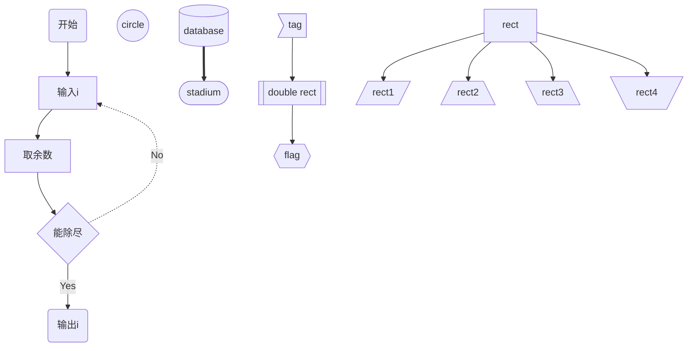
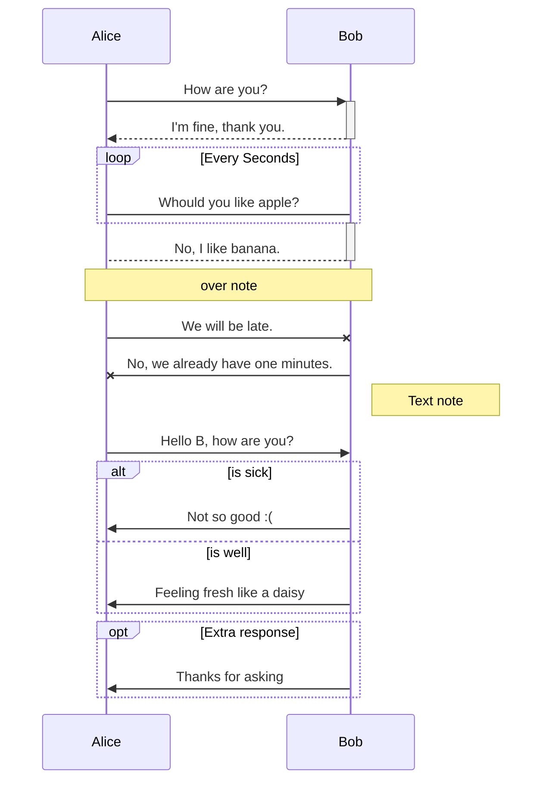

# Mermaid

## 流程图

```mermaid
flowchart TB
    start(开始) --> input[输入i] --> mod[取余数] --> if{能除尽} -->|Yes| output(输出i)
    if -.->|No| input

    circle((circle))

    database[(database)] ==> stadium([stadium])

    tag>tag] --> doublerect[[double rect]] --> flag{{flag}}

    rect[rect] --> rect1[/rect1/]
    rect --> rect2[/rect2\]
    rect --> rect3[\rect3\]
    rect --> rect4[\rect4/]
```

## 序列图

```mermaid
sequenceDiagram
    participant A as Alice
    participant B as Bob

    A ->>+ B: How are you?
    B -->>- A: I'm fine, thank you.

    loop Every Seconds
    A -> B: Whould you like apple?
    end
    activate B
    B --> A: No, I like banana.
    deactivate B

    note over A , B: over note

    A -x B: We will be late.
    B -x A: No, we already have one minutes.

    note right of B: Text note

    A->>B: Hello B, how are you?
    alt is sick
        B->>A: Not so good :(
    else is well
        B->>A: Feeling fresh like a daisy
    end
    opt Extra response
        B->>A: Thanks for asking
    end
    
```