# 项目质量管理

## 持续改进

戴明环 PDCA 循环

> **85%的质量问题应由管理层负领导责任；另外15%由团队成员负责。项目经理负责质量管理责任，团队成员负把事情做对的成果责任。**

## 全面质量管理

全过程的质量管理和全员参与的质量管理。

## 第一次就把事情做对

> 第一次就把事情做对，防止因产品不符合要求而带来的相关成本，是节约成本的做法。

- 代价最小
- 建立预防系统

## 质量是免费的

> 质量成本是用不合格成本来考察。一次就把质量做合格，使失败成本降为零，质量就是免费的。

## 预防胜于检查

> 质量是被规划和设计出来的，而不是检查出来的。

质量更多的应该是一种预防行为，而不是一种发现过程。

## 准时制（零库存）管理

> 把库存降为零，促使人们注重质量，力争一次就把事情做对。

- 提高管理效率
- 可以减少因库存而占用的较多资金
- 加快资金的周转速度
- 有效回避产品积压的风险
- 降低库存管理的成本

## 本章要点

- 质量管理的理念
- 质量管理大师及其理论
- 管理质量和控制质量过程的区别