# 项目资源管理

## 本章要点

+ 概述： 自组织团队，虚拟团队，分布式团队
+ 规划资源管理：图表-层级型（WBS/OBS/资源分解结构）、矩阵型（责任分配矩阵/RACI）、文本型，资源管理计划，团队章程
+ 估算活动资源：资源分解结构，资源需求，估算依据
+ 获取资源：多标准决策分析，谈判，预分派，十五字呀分配单，项目团队派工单，资源日历
+ 建设团队：塔克曼模型5阶段特点和领导风格，集中办公，团队建设，认可与奖励，培训，个人和团队评估，团建绩效评价
+ 管理团队：冲突管理5办法，情商，影响力，领导力
+ 控制资源：问题解决6步骤，谈判