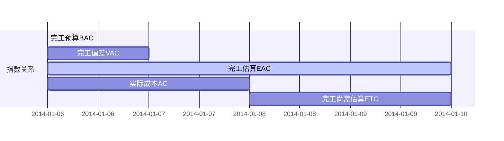

# 挣值分析

## 绩效指标
PV (Planned Value) = 计划工作量 X 计划单价
EV (Earned Value) = 实际工作量 X 计划单价
AC (Actual Cost) = 实际工作量 X 实际单价
BAC (Budget At Completion) 完工预算

SV (Schedule Variance) = EV - PV
SPI (Schedule Performance Index) = EV / PV

CV (Cost Variance) = EV - AC
CPI (Cost Performance) = EV / AC

PC (Percentage Completed) = EV / BAC

## 预测

ETC (Estimate To Completion) 完工尚需估算

EAC (Estimate At Completion) 完工估算

BAC (Budget At Completion) 完工预算

VAC (Variance At Completion) 完工偏差

EAC = AC +　ETC = BAC + VAC

### 典型偏差

ETC = (BAC - EV)/CPI

EAC = AC + (BAC - EV)/CPI
EAC = BAC/CIP

### 非典型偏差

ETC = BAC - EV

EAC = AC + BAC - EV

### 工期不可变更

ETC = (BAC - EV)/(CPI * SPI)

EAC = AC + (BAC - EV)/(CPI * SPI)

### 完工尚需绩效指数

TPCI (To Completion Performance Index) 完工尚需绩效指数

$$
TCPI = \frac{BAC - EV}{BAC - AC} = \frac{剩余工作需要的钱}{剩余的实际钱数}
$$

BAC不可行时，用EAC替代

$$
TCPI = \frac{BAC - EV}{EAC - AC} = \frac{剩余工作需要的钱}{剩余的实际钱数}
$$

## 挣得进度

PS (Planed Schedule)

AT (Actual Time)

SV (Schedule Variance) = PS - AT

PAR (Planed Accomplished Ratio) = BAC / SAC

ES (Earned Schedule) = EV / PAR

TV (Time Variance) = SV / PAR

SAC (Schedule At Completion)

SPI (Schedule Performance Index) = ES / AT