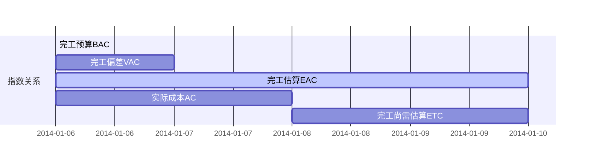

# 工具和技术

## 蒙特卡洛模拟
## [关键路径法](https://www.sohu.com/a/219232101_684517)
## 迭代燃尽图
## QC七大手法
- 因果图
- 直方图
- 流程图
- 控制图
- 核查表
- 散点图
- 帕累托图

## 固定资产折旧

### 直线折旧

### 双倍余额递减法

### 年数总和折旧法

## 财务技术

### 资金的时间价值

$$
F_n = P(1+R)^n
$$

### 投资回收期

### 投资回报率 ROI

### 净现值法 NPV

> 考虑了时间，可以不再考虑工期或投资回收期长短

### 内部收益率 IRR

### 收益成本率 BCR

## 数据分析

### 挣值分析

#### 绩效指标
PV (Planned Value) = 计划工作量 X 计划单价
EV (Earned Value) = 实际工作量 X 计划单价
AC (Actual Cost) = 实际工作量 X 实际单价
BAC (Budget At Completion) 完工预算

SV (Schedule Variance) = EV - PV
SPI (Schedule Performance Index) = EV / PV

CV (Cost Variance) = EV - AC
CPI (Cost Performance) = EV / AC

PC (Percentage Completed) = EV / BAC

#### 预测

ETC (Estimate To Completion) 完工尚需估算

EAC (Estimate At Completion) 完工估算

BAC (Budget At Completion) 完工预算

VAC (Variance At Completion) 完工偏差

EAC = AC +　ETC = BAC + VAC
///*

TPCI (To Completion Performance Index) 完工尚需绩效指数

$$
TCPI = \frac{BAC - EV}{BAC - AC} = \frac{剩余工作需要的钱}{剩余的实际钱数}
$$

BAC不可行时，用EAC替代

$$
TCPI = \frac{BAC - EV}{EAC - AC} = \frac{剩余工作需要的钱}{剩余的实际钱数}
$$

### 挣得进度

PS (Planed Schedule)

AT (Actual Time)

SV (Schedule Variance) = PS - AT

PAR (Planed Accomplished Ratio) = BAC / SAC

ES (Earned Schedule) = EV / PAR

TV (Time Variance) = SV / PAR

SAC (Schedule At Completion)

SPI (Schedule Performance Index) = ES / AT

### 偏差分析
### 趋势分析
### 储备分析